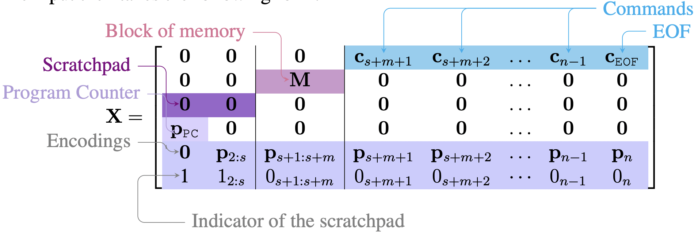

# Training-Looped-Transformers

We investigate whether a transformer initialized at random can be trained to execute OISC programs, as a follow up of "[Looped Transformers as Programmable Computers](https://arxiv.org/pdf/2301.13196v1.pdf)"

## OISC definition
We use SUBLEQ, which is capable of defining a universal computer. 

    SUBLEQ(a, b, c):
        mem[b] = mem[b] - mem[a]
        if mem[b] ≤ 0:
            goto instruction c
        else:
            PC = PC + 1

## Data format

The input and output space is a $n\times d$ matrix. For each $d$-dimensional token, $\log(n)$ bits is used for positional encoding, $1$ bit is used for indicator of scratchpad. In memory column, $N$ bits are used for storing integer in memory. In an instruction column, $3\log(n)$ bits are used to store instruction. In a scratch pad column, $2N$ bits are used to store intermediate computations and $\log(n)$ for program counter. Therefore the total column height is $5\log(n)+3N+1$.
## Hyperparameters
* $N$: number of bits for each stored integer
* $s$: columns of scatch pad
* $m$: number of memory locations
* $n$: total number of columns, so number of instructions is $n-m-s$. 
## Data Generation
We use a python script to simulate `SUBLEQ` and generate the input/ouput pairs. 
## Architecture
We use a the transformer encoder in the [vanilla transfomer model](https://pytorch.org/docs/stable/generated/torch.nn.Transformer.html).

## Things I have tried
* Train set 10k pairs, val set 500. Each input/output pair is a randomly initialized memory and result of executing one step
* Transformer encoder depth 1/2/4/9/16 layers, width (hidden dimension) 512, number of heads 1/2/4/8
* L1/L2/ Huber loss
* 0 --> -100, 1 --> +100

